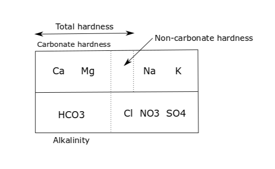

```{r setup, include=FALSE}
library(dplyr)
library(readr)
library(stringr)
library(ggplot2)

knitr::opts_chunk$set(echo = FALSE, message = FALSE, warning =FALSE)
source("functions.R")
source("data.R")
```


# Water for Coffee

## Water composition

### pH and Carbon Dioxode

$H_2O + CO_2 \to H_2CO_3 \to {HCO_3}^- + {H}^+ \to {CO_3}^{2-} + 2{H}^+$

- get explanation from Section 2.1

### Alkalinity and Hardness

Alkalinity is the capacity of water to buffer acids, i.e. measures the amount of acid that has to be added to reach a specific $pH$. In other words, alkalinity is the capacity of water to resist to a change in pH when acids are added. 

Water alkalinity is given by the following components:

${HCO_3}^- + 2{CO_3}^{2-} + {OH}^- - {H}^+$

If $pH < 8.3$, the alkalinity is equal to the amount of ${HCO_3}^-$, the other components being very low. 

The (total) hardness of water is given by the sum of $Ca^{2+}$ and $Mg^{2+}$ ions (in amount/concentration). The carbonate hardness represents the minimum of total hardness and alkalinity. 

For water with total hardness greater than alkalinity, we have the following componence:

```{r, out.width = '60%', fig.align='center'}

```


For coffee extraction, the alkalinity influences the acid buffer capacity, while the hardness influences the extraction efficiency. 

- Explain the formation of limescale. 

### Measurement units

Water components are measured in: 

 - $mol/L$ - amount concentration (total number of entities in a volume),
 - $mg/L$  - mass concentration (total weight of entities in a volume).
 
Since $Ca^{2+}$, $Mg^{2+}$ and ${HCO_3}^{-}$ have different masses, we have the following transformations:

- $Ca^{2+}$: $1 \; mmol/L$ = $40 \; mg/L$,
- $Mg^{2+}$: $1 \; mmol/L$ = $24.3 \; mg/L$,
- ${HCO_3}^{-}$: $1 \; mmol/L$ = $61 \; mg/L$.

Equivalents units are $ppm \; CaCO_3$ or $mg \; CaCO_3/L$ and German degrees ($^{\circ}d$). For hardness and alkalinity, we have:

- $Ca^{2+}$: $1 \; mg/L$ = $2.497 \; ppm \; CaCO_3$,
- $Mg^{2+}$: $1 \; mg/L$ = $4.118 \; ppm \; CaCO_3$,
- ${HCO_3}^{-}$: $1 \; mg/L$ = $0.8202 \; ppm \; CaCO_3$.

Moreover, between $ppm \; CaCO_3$ and German degrees, we have:

- $1\; ^{\circ}d$ = $17.85 \; ppm \; CaCO_3$,
- $1 \; ppm \; CaCO_3$ = $0.05603 \; ^{\circ}d$.


### Impact of water components on coffee extraction

Small amount of hardness is desirable for coffee brewing since water acts as a solvent. Low mineral content si desirable ($TDS$ or dry residue at $180^{\circ}$). If water is too soft, then it cannot extract flavors from coffee and the result is going to be sour/acidic. If water is too hard, the extraction will lack acidity and have dull, bitter taste. 

Collona-Dashwood and Hendon (2014) studied the impact of water components in disolving coffee components. They considered the following components present in the coffee beans:

1. lactic acid - pleasant sour notes,
2. malic acid - pleasant sour notes, 
3. citric acid - pleasant sweet flavor,
4. quinic acid - pungent, unpalatable, 
5. chlorogenic acid - pungent, unpalatable,
6. caffeine,
7. eugenol - woody notes. 

Sodium (${Na}^{+}$) does not facilitate the extraction of caffeine or eugenol and does not influence very much the extraction of the acids. 

Calcium (${Ca}^{2+}$) and Magnesium (${Mg}^{2+}$) are responsible in general for flavor extraction, with Magnesium being more efficient than Calcium. 

Magnesium has highest bindings for all components, it increases extraction yield more than Calcium. Magnesium would extract more desirable flavors than Calcium (lactic, malic, citric acids), but also undesirable acids (quinic, chlorogenic), which makes the presence of bicarbonates important since they act as acid buffer.   

Calcium bindign to caffeine is very weak. Bicarbonates (${HCO_3}^{-}$) interact strongly with the chlorogenic acid, neutralizing its flavor. Potassium ($K^+$) does not influence extraction, it already exists in the coffee beans. 

Magnesium rich waters increase extraction yield and prevent the formation of limescale. For light roasts, Calcium and Magnesium do a similar job in extraction. 

The bicarbonates from water react with acids extracted from coffee neutralizing parts of them. Thus, the perceived acidity of coffee is given by the acids extracted from coffee minus the buffering effect of alkalinity. 

Chloride (${Cl}^-$) does not have taste, hence no influence on the coffee extraction. Do not confuse choride with hypochloride (${ClO}^-$) which is very unpleasant. 

The ideal water for coffee extraction according to SCAA, 2009:

- alkalinity: $\approx 40 \; ppm\; CaCO_3$,
- total hardness: $\approx 68 \; ppm\; CaCO_3$ (acceptable range 17 - 85). 

Collona-Dashwood and Hendon (2014) propose an ideal zone for alkalinity/hardness:

```{r, out.width = '60%', fig.align='center'}
create_recipe(data, c("Distilled water"), c(1)) %>% 
    filter(Brands != "Distilled water") %>% 
    plot_recipes()
```


#### Espresso extraction 

The acid buffer effect of bicarbonates is much lower in espresso than in filter, since the mass ratio is much bigger: 1:2 for espresso compared to 1:15 for filter. Moreover, extraction pressure increases the solubility of $CO_2$ and this increases the acidity. 

Higher alkalinity and hardness might still give a high quality extraction. At high alkalinity ($>\; 100 \; ppm \; CaCO_3$), more acids extracted from coffee are neutralized by ${HCO_3}^{-}$ and high pressure and temperature increase the formation of $CO_2$ which in turn increases the resistance of the coffee bed.  


```{r, eval=FALSE}
# fix HTML to include in shiny app
xml2::write_html(rvest::html_node(xml2::read_html("details.html"), "body"), file = "details_fixed.html")
```


